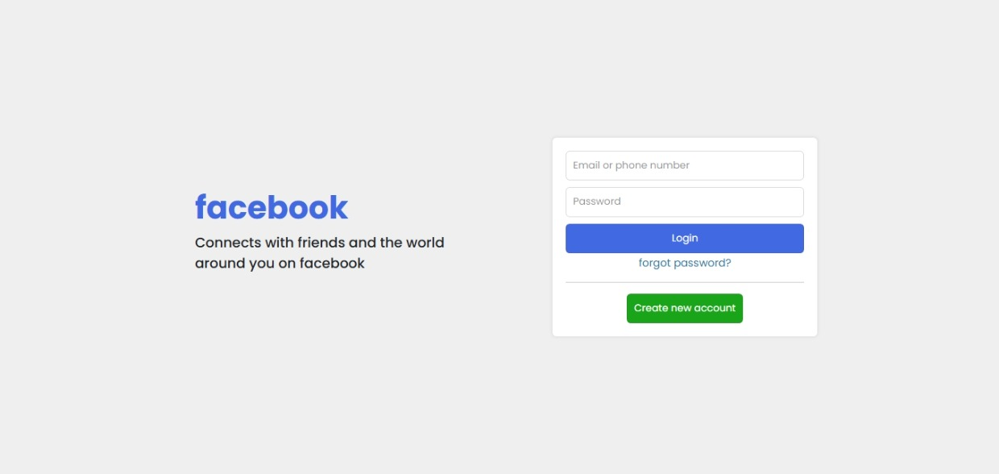
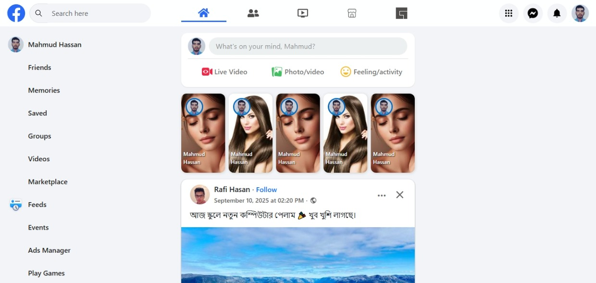
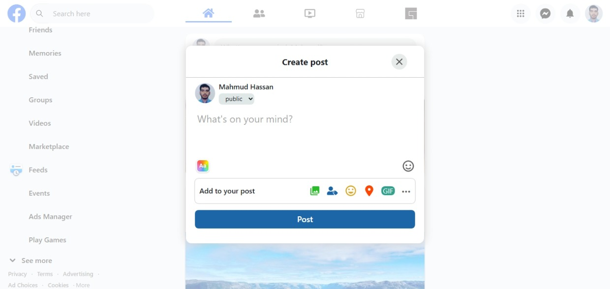
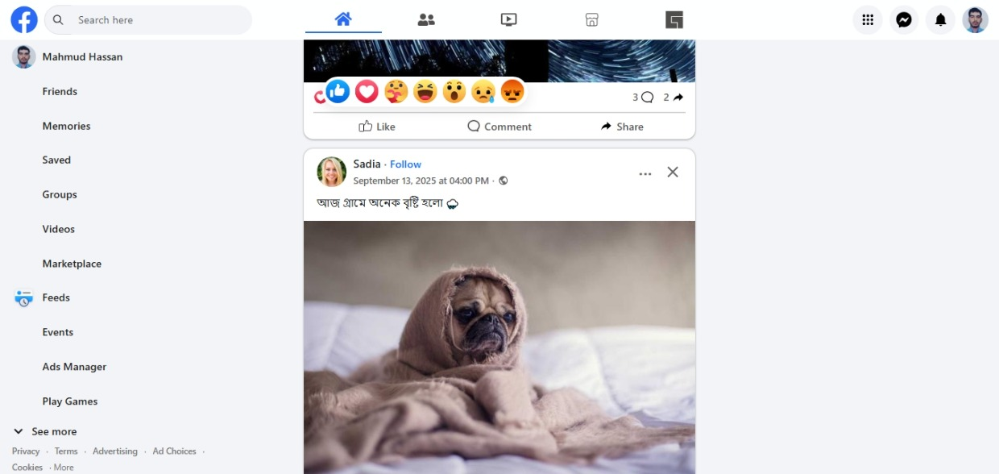

# Facebook UI Clone (Desktop Only)

This project is a **pixel-perfect UI clone** inspired by Facebook, built to demonstrate my frontend development skills — especially layout, styling, and component structuring.

> ⚠️ This is **not a full production-ready application**. The main focus is UI accuracy, not backend architecture or code quality.

---

## 🔗 Live Demo

- **Frontend:** https://facebook-ui-clone-orcin.vercel.app
- **Backend (API):** https://facebook-ui-clone-server.vercel.app

---

## 📸 Demo Preview

  
  
  
  

## 🎯 Purpose

The goal of this project is to:

- Practice **real-world UI replication**
- Improve **CSS layout and responsiveness (desktop-focused)**
- Demonstrate ability to build complex UI from an existing product
- Showcase frontend skills for portfolio/recruiters

---

## 🖥️ Device Support

- ✅ Desktop (optimized)
- ❌ Mobile (not supported)
- ❌ Tablet (not supported)

> This project is intentionally built only for large screens.

---

## ⚙️ Features

- Facebook-style post feed UI
- Pagination ("Load more" posts)
- Basic authentication flow (login)
- Component-based architecture using React
- Dynamic data rendering from backend

---

## 🛠️ Tech Stack

**Frontend:**

- React (Vite)
- CSS Modules

**Backend:**

- Node.js
- Express
- MongoDB

---

## ⚠️ Important Notes

- The codebase is **not optimized for production**
- Backend is minimal and only supports required UI functionality
- Some features may be incomplete or simplified
- Focus was on **UI accuracy, not scalability or clean architecture**

---

## 📌 What I Learned

- Building complex UI layouts from scratch
- Managing component structure in React
- Handling real API integration with UI
- Debugging real-world issues (auth, deployment, etc.)

---

## 🚀 Future Improvements (Optional)

- Make it fully responsive (mobile + tablet)
- Improve code structure and scalability
- Add better state management
- Optimize performance

---

## 🙌 Final Note

This project represents my ability to **replicate real-world UI with precision**.
It is part of my journey toward becoming a professional full-stack developer.

---
